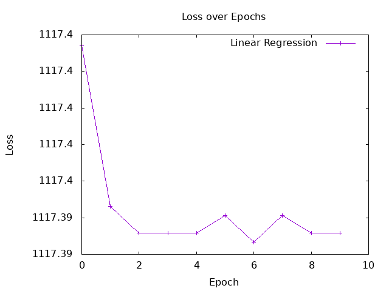
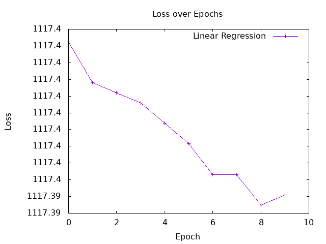
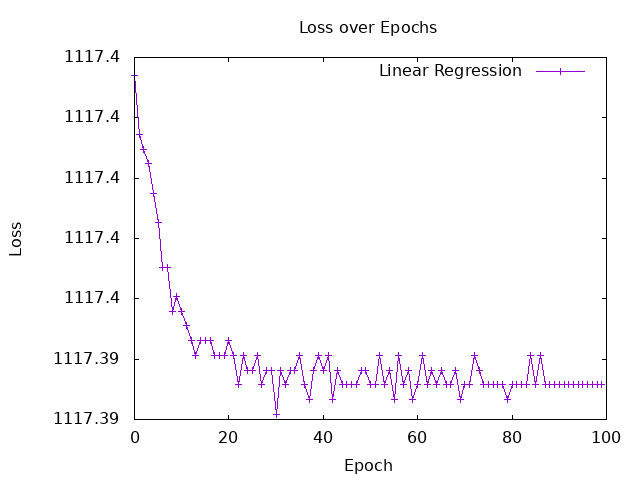

# Hands-on Tasks

## 3-b Result of the Linear Function
実行コマンド
```
stack run Session3-linear-regression 
```

```
correct answer: 130
estimated: 176.72504
******
correct answer: 195
estimated: 197.81503
******
correct answer: 218
estimated: 249.43002
******
correct answer: 166
estimated: 193.93002
******
correct answer: 163
estimated: 214.46503
******
correct answer: 155
estimated: 165.07004
******
correct answer: 204
estimated: 178.94504
******
correct answer: 270
estimated: 203.36502
******
correct answer: 205
estimated: 164.51503
******
correct answer: 127
estimated: 137.87503
******
correct answer: 260
estimated: 211.69003
******
correct answer: 249
estimated: 238.33002
******
correct answer: 251
estimated: 236.11005
******
correct answer: 158
estimated: 158.41003
******
correct answer: 167
estimated: 190.60004
******
```

```
import Torch.Tensor (Tensor, asTensor)
import Torch.Functional (mean, add, mul)

ys :: Tensor
ys = asTensor ([130, 195, 218, 166, 163, 155, 204, 270, 205, 127, 260, 249, 251, 158, 167] :: [Float])
xs :: Tensor
xs = asTensor ([148, 186, 279, 179, 216, 127, 152, 196, 126, 78, 211, 259, 255, 115, 173] :: [Float])

-- 予測値を返す
linear :: 
    (Tensor, Tensor) -> -- ^ parameters ([a, b]: 1 × 2, c: scalar)
    Tensor ->           -- ^ data x: 1 × 10
    Tensor              -- ^ z: 1 × 10
linear (slope, intercept) input = 
    let y = mul slope input
    in add y intercept

main :: IO ()
main = do
  -- Below are pseudo code
  let sampleA = asTensor (0.555 :: Float)
  let sampleB = asTensor (94.585026 :: Float)
	
  -- Iterate through the provided xs and ys data. 
  -- For each pair, convert x to a tensor, calculate the estimatedY using your linear function with the provided sampleA and sampleB, and print both the correct y and the estimatedY.
  
  let estimatedYs = linear (sampleA, sampleB) xs

  putStrLn $ "correct answer: "
  print ys

  putStrLn $ "estimated: "
  print estimatedYs
    
    -- Expected outputs:
    -- correct answer: 148
    -- estimated: ?
    -- *******
    -- correct answer: 186
    -- ...
  return ()
```

## 3-d Define a cost function
```
-- 予測値がどれくらいずれているか計算する関数
cost ::
    Tensor -> -- ^ grand truth: 1 × 10
    Tensor -> -- ^ estimated values: 1 × 10
    Tensor    -- ^ loss: scalar
cost z z' = 
    let diff = z - z' 
        squared = mul diff diff                 -- 要素ごとの掛け算
    in  mean squared
```

## 3-e 
```
calculateNewA :: 
     Tensor ->
     Tensor ->
     Tensor
calculateNewA a y = a - rate * gradA
  where
    diff = y - ys
    rate = 0.01 -- 学習率
    gradA = mean ( mul 2 (mul diff xs) )-- 勾配の計算（コスト関数のaに対する偏微分）

calculateNewB :: 
     Tensor ->
     Tensor ->
     Tensor
calculateNewB b y = b - rate * gradB
  where
    diff = y - ys
    rate = 0.01 -- 学習率
    gradB = mean ( mul 2 diff ) -- 勾配の計算（コスト関数のbに対する偏微分）
```

## 3-f,g

gの実行コマンド
```
stack run
```

```
-- 指定したエポック数だけ学習を繰り返す再帰関数
trainLoop :: Int -> Int -> Tensor -> Tensor -> IO (Tensor, Tensor)
trainLoop currentEpoch maxEpoch a b 
  | currentEpoch > maxEpoch = do
      putStrLn "Training completed!"
      return (a, b)  -- 目標エポックに達したら、最終的なパラメータを返す
  | otherwise = do
      -- 1. 現在の a と b で予測値と、ズレ（Loss）を計算
      let estimatedYs = linear (a, b) xs
          currentLoss = cost ys estimatedYs  
      
      -- 2. 現在のエポック数と Loss を画面に表示
      putStrLn $ "Epoch " ++ show currentEpoch ++ " - Loss: " ++ show (asValue currentLoss :: Float)
      
      -- 3. a と b を更新（※前回修正した asTensor や sub を使った関数を呼び出します）
      let newA = calculateNewA a estimatedYs
          newB = calculateNewB b estimatedYs

      putStrLn $ "Updated parameters - a: " ++ show (asValue newA :: Float) ++ ", b: " ++ show (asValue newB :: Float)
      
      -- 4. 新しくなったパラメータを渡して、次のエポックへ進む（再帰呼び出し）
      trainLoop (currentEpoch + 1) maxEpoch newA newB
```
0.00001の時
```
--- Training Started ---
Epoch 1 - Loss: 1117.3969
Updated parameters - a: 0.5551905, b: 94.58503
Epoch 2 - Loss: 1117.3947
Updated parameters - a: 0.55524576, b: 94.58503
Epoch 3 - Loss: 1117.3943
Updated parameters - a: 0.5552618, b: 94.58503
Epoch 4 - Loss: 1117.3943
Updated parameters - a: 0.55526644, b: 94.58503
Epoch 5 - Loss: 1117.3943
Updated parameters - a: 0.5552678, b: 94.58503
Epoch 6 - Loss: 1117.3945
Updated parameters - a: 0.5552682, b: 94.58503
Epoch 7 - Loss: 1117.3942
Updated parameters - a: 0.5552683, b: 94.58503
Epoch 8 - Loss: 1117.3945
Updated parameters - a: 0.55526835, b: 94.58503
Epoch 9 - Loss: 1117.3943
Updated parameters - a: 0.55526835, b: 94.58503
Epoch 10 - Loss: 1117.3943
Updated parameters - a: 0.55526835, b: 94.58503
Training completed!
```


0.000001の時
```
--- Training Started ---
Epoch 1 - Loss: 1117.3969
Updated parameters - a: 0.5550191, b: 94.58503
Epoch 2 - Loss: 1117.3964
Updated parameters - a: 0.5550368, b: 94.58503
Epoch 3 - Loss: 1117.3962
Updated parameters - a: 0.55505323, b: 94.58503
Epoch 4 - Loss: 1117.3961
Updated parameters - a: 0.5550685, b: 94.58503
Epoch 5 - Loss: 1117.3959
Updated parameters - a: 0.5550827, b: 94.58503
Epoch 6 - Loss: 1117.3956
Updated parameters - a: 0.55509585, b: 94.58503
Epoch 7 - Loss: 1117.3953
Updated parameters - a: 0.5551081, b: 94.58503
Epoch 8 - Loss: 1117.3953
Updated parameters - a: 0.55511945, b: 94.58503
Epoch 9 - Loss: 1117.3949
Updated parameters - a: 0.55513, b: 94.58503
Epoch 10 - Loss: 1117.395
Updated parameters - a: 0.55513984, b: 94.58503
Training completed!
```


エポックを100にした時
