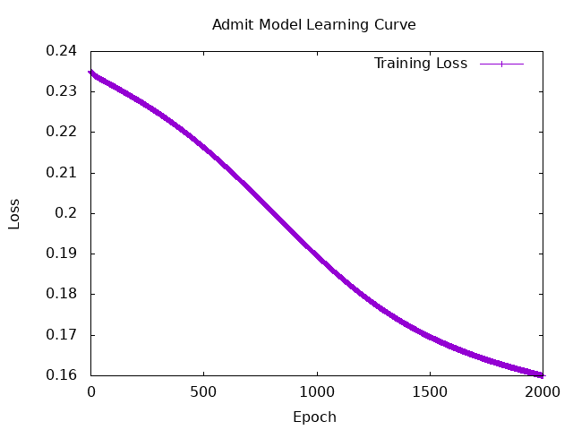
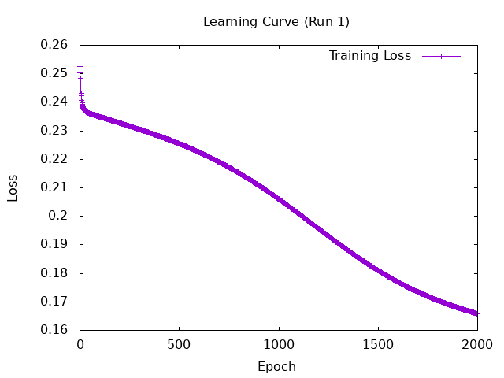
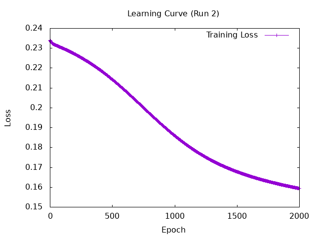
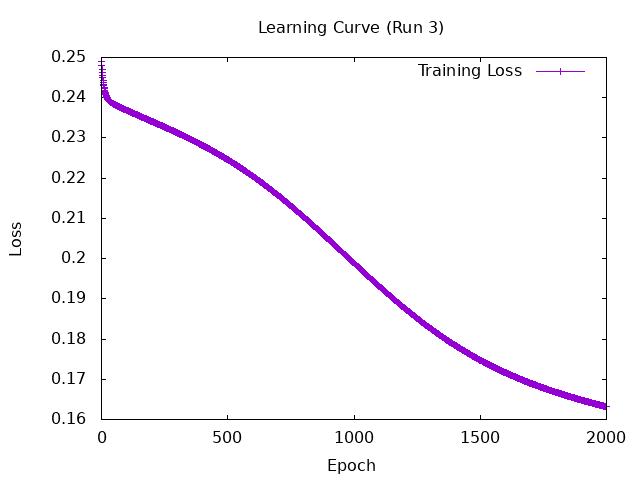
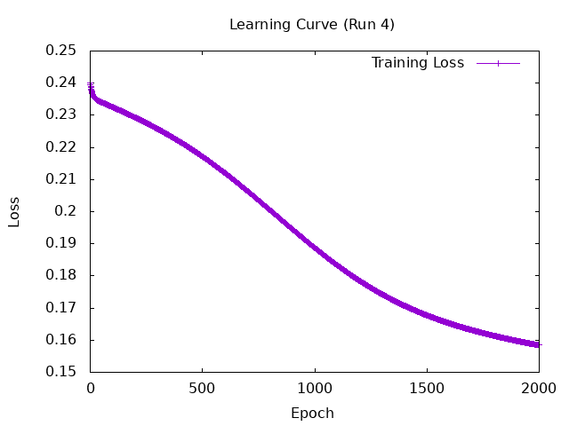
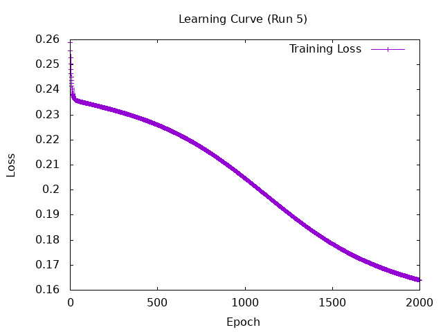
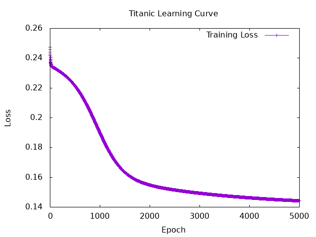

# Hands on Tasks
# 1 Creat Haskell evaluation function to calculate

## Confusion Matrix
```
-- | 混同行列 (Confusion Matrix) の作成
-- 引数: クラス数, 正解ラベルのリスト, 予測ラベルのリスト
-- 出力: 2次元リスト [[Int]]
confusionMatrix :: Int -> [Int] -> [Int] -> [[Int]]
confusionMatrix numClasses actuals preds =
    let     
        -- 正解と予測をペア (actual, pred) にする 
        pairs = zip actuals preds
        -- クラス i と j のペア (i, j) が何回出現するかを数える関数
        count target = length (filter (== target) pairs)
    in [[count (i, j) | j <- [0..numClasses-1]] | i <- [0..numClasses-1]]
```
## Accuracy
```
-- | 正解率 (Accuracy) の計算
accuracy :: [Int] -> [Int] -> Double
accuracy actuals preds = 
    let 
        correctPairs = filter (\( a, p) -> a == p) (zip actuals preds)
        correctCount = length correctPairs
        totalCount = length actuals
    in fromIntegral correctCount / fromIntegral totalCount
```
`Int`同士では割り算できないので、`fromIntegral`を用いて`Double`に変換する
## Precision
これがターゲットであると、予測したもののうち、本当にターゲットだった割合
```
-- | 指定したクラスに対する Precision (適合率)
precision :: Int -> [Int] -> [Int] -> Double
precision targetClass actuals preds = 
    let 
        -- zip で正解と予測をペアにする
        pairs = zip actuals preds
        -- 分母を求める pと予測したものの数
        predictedCount = length (filter (\( _, p) -> p == targetClass) pairs)
        -- 分子を求める 正解値と予測値が等しかったものの数
        truePositiveCount = length (filter (\( a, p) -> a == targetClass && p == targetClass) pairs)
    in if predictedCount == 0 
        then 0 
        else fromIntegral truePositiveCount / fromIntegral predictedCount
```
## Recall
実際に存在するターゲット全体のうち、正しく見つけ出せた割合
```
-- | 指定したクラスに対する Recall (再現率)
recall :: Int -> [Int] -> [Int] -> Double
recall targetClass actuals preds = 
    let 
        -- zip で正解と予測をペアにする
        pairs = zip actuals preds
        -- 分母を求める 正解がaの数
        actualCount = length (filter (\( a, _) -> a == targetClass) pairs)
        -- 分子を求める　正解値と予想値が等しかったものの数
        truePositiveCount = length (filter (\( a, p) -> a == targetClass && p == targetClass) pairs)
    in if actualCount == 0 
        then 0 
        else fromIntegral truePositiveCount / fromIntegral actualCount
```
## F1 score
$$
F_1 = 2 \times \frac{\text{Precision} \times \text{Recall}}{\text{Precision} + \text{Recall}}
$$
```
-- | 指定したクラスに対する F1スコア (調和平均)
f1Score :: Int -> [Int] -> [Int] -> Double
f1Score targetClass actuals preds = 
    -- 2 * (P * R) / (P + R)
    let 
        -- 適合率
        p = precision targetClass actuals preds
        -- 再現率
        r = recall targetClass actuals preds
    in if p + r == 0 
        then 0 
        else 2 * p * r / (p + r)
```
## Micro-F1 Score
全てのクラスを平等に扱う
```
-- | Macro-F1 スコア: 全クラスのF1スコアの単純平均
macroF1 :: Int -> [Int] -> [Int] -> Double
macroF1 numClasses actuals preds = 
    let f1s = [f1Score i actuals preds | i <- [0..numClasses-1]]
        totalF1 = sum f1s
    in if numClasses == 0 
        then 0 
        else totalF1 / fromIntegral numClasses
```
## Weighted-F1 Score
データの量に応じて評価を変える
```
-- | Weighted-F1 スコア: 各クラスのデータ数を重みとした平均
weightedF1 :: Int -> [Int] -> [Int] -> Double
weightedF1 numClasses actuals preds = 
    let 
        pairs = zip actuals preds
        -- 各クラスのデータ数を求める
        classCounts = [length (filter (\( a, _) -> a == i) pairs) | i <- [0..numClasses-1]]
        -- 各クラスのF1スコアを求める
        f1s = [f1Score i actuals preds | i <- [0..numClasses-1]]
        -- 重み付きF1スコアを計算 [ データ数 * F1スコア ]
        weightedF1s = zipWith (\count f1 -> fromIntegral count * f1) classCounts f1s
        totalWeightedF1 = sum weightedF1s
        totalSamples = sum classCounts
    in if totalSamples == 0 
        then 0 
        else totalWeightedF1 / fromIntegral totalSamples
```
## Micro-F1 Score
全体を一つの塊として考える
```
-- | Micro-F1 スコア: 全体のTP, FP, FNから計算
microF1 :: Int -> [Int] -> [Int] -> Double
microF1 numClasses actuals preds = 
    let 
        pairs = zip actuals preds
        -- 全クラスのTP, FP, FNを合計する
        truePositives = sum [length (filter (\( a, p) -> a == i && p == i) pairs) | i <- [0..numClasses-1]]
        falsePositives = sum [length (filter (\( a, p) -> a /= i && p == i) pairs) | i <- [0..numClasses-1]]
        falseNegatives = sum [length (filter (\( a, p) -> a == i && p /= i) pairs) | i <- [0..numClasses-1]]
        -- Micro-F1を計算
    in if truePositives + falsePositives + falseNegatives == 0 
        then 0 
        else 2 * fromIntegral truePositives / (2 * fromIntegral truePositives + fromIntegral falsePositives + fromIntegral falseNegatives)
```
# 2 Build and evaluate the model to predict chance of admit

```
{-# LANGUAGE DeriveAnyClass #-}
{-# LANGUAGE DeriveGeneric #-}
{-# LANGUAGE FunctionalDependencies #-}
{-# LANGUAGE RecordWildCards #-}

module Admit where

import Control.Monad (when, foldM) -- foldMを追加
import Data.List (foldl', intersperse, scanl', transpose)
import GHC.Generics
import Torch
import Torch.NN      
import Torch.Optim   
import qualified Data.ByteString.Lazy as BL
import Data.Csv
import qualified Data.Vector as V
import Chart (drawLearningCurve)
--------------------------------------------------------------------------------
-- Data Loading (Kaggle Admission Data)
--------------------------------------------------------------------------------

-- CSVの1行分を表すデータ型
data AdmitData = AdmitData
  { serialNo :: Float
  , gre      :: Float
  , toefl    :: Float
  , rating   :: Float
  , sop      :: Float
  , lor      :: Float
  , cgpa     :: Float
  , research :: Float
  , chance   :: Float
  } deriving (Generic, FromRecord, Show)
  -- FromRecord をつけると、cassavaが自動的にCSVの列と紐づけてくれます


-- CSVファイルを読み込んで、(入力テンソル, 正解テンソル) のペアを作る関数
loadAdmitData :: FilePath -> Float -> IO (Tensor, Tensor)
loadAdmitData filepath threshold = do
    csvData <- BL.readFile filepath
    case decode HasHeader csvData of
        Left err -> error $ "CSV読み込みエラー: " ++ err
        Right records -> do
            let dataList = V.toList records
                -- 【修正】各特徴量を最大値（概算）で割って正規化 (0~1の範囲に収める)
                inputs = map (\d -> [ gre d / 340.0
                                    , toefl d / 120.0
                                    , rating d / 5.0
                                    , sop d / 5.0
                                    , lor d / 5.0
                                    , cgpa d / 10.0
                                    , research d ]) dataList
                
                targets = map (\d -> if chance d >= threshold then [1.0 :: Float] else [0.0 :: Float]) dataList                
            return ( toDType Float $ asTensor inputs
                   , toDType Float $ asTensor targets )

--------------------------------------------------------------------------------
-- MLP
--------------------------------------------------------------------------------

-- ネットワークの設計図
data MLPSpec = MLPSpec
  { feature_counts :: [Int],   -- 各層のニューロンの数
    nonlinearitySpec :: Tensor -> Tensor     -- 活性化関数
}

-- 実際にメモリ上に存在するネットワークの構造
data MLP = MLP
  { layers :: [Linear],
    nonlinearity :: Tensor -> Tensor
  }
  deriving (Generic, Parameterized)      -- このネットワークの中に入っている重みとバイアスを自動的に見つけてくれる
-- Linear型・・・線形層
-- w * x + b という計算を行い、重みとバイアスを持つ

-- 設計と実体を分ける
-- Haskellが副作用を嫌うから
-- 設計は純粋な値で表現し、実体はランダムに初期化される

-- MLPSpecからMLPを作るためのルール
instance Randomizable MLPSpec MLP where
  sample MLPSpec {..} = do
    let layer_sizes = mkLayerSizes feature_counts
    linears <- mapM sample $ map (uncurry LinearSpec) layer_sizes
    return $ MLP {layers = linears, nonlinearity = nonlinearitySpec}
    where
      mkLayerSizes (a : (b : t)) =
        scanl shift (a, b) t
        where
          shift (a, b) c = (b, c)

mlp :: MLP -> Tensor -> Tensor
mlp MLP {..} input = foldl' revApply input $ intersperse nonlinearity $ map linear layers
  where
    revApply x f = f x

numIters = 2000

model :: MLP -> Tensor -> Tensor
model params t = mlp params t
main :: IO ()
main = do
  (x, y) <- loadAdmitData "Session5/data/Admission_Predict.csv" 0.7
  
  init <- sample $ MLPSpec
        { feature_counts = [7, 16, 1],
          nonlinearitySpec = Torch.sigmoid
        }
        
  let optimizer = GD -- オプティマイザの初期化　GD = 勾配降下法

  -- オプティマイザの更新状態も引き継ぐようにループの型を変更
  ((trained, _), losses) <- foldLoop ((init, optimizer), []) numIters $ \((state, opt), lossHistory) i -> do
    
    -- モデルの出力結果全体に対して最後にsigmoidをかける (intersperseの仕様回避)
    let y' = squeezeAll $ Torch.sigmoid $ model state x
        target = squeezeAll y
        loss = mseLoss target y'
        
    when (i `mod` 100 == 0) $ do
      putStrLn $ "Iteration: " ++ show i ++ " | Loss: " ++ show loss
      
    -- 新しいオプティマイザ(newOpt)も受け取って次に渡す
    (newState, newOpt) <- runStep state opt loss 1e-1　　-- 1e-1は学習率
    
    let currentLoss = asValue loss :: Float 
    return ((newState, newOpt), lossHistory ++ [currentLoss])
  
  putStrLn "モデルの予測結果（最初の5件分）:"
  -- 予測時にも忘れずに sigmoid をかける
  let finalPreds = squeezeAll $ Torch.sigmoid $ model trained x
  print (sliceDim 0 0 5 1 finalPreds)
  
  putStrLn "実際の正解データ（最初の5件分）:"
  print (sliceDim 0 0 5 1 (squeezeAll y))

  putStrLn "\nTraining Complete!"
  
  putStrLn "学習曲線を生成中..."
  drawLearningCurve "Session5/learning_curve.png" "Admit Model Learning Curve" [("Training Loss", losses)]
  putStrLn "learning_curve.png を保存しました！"

  ```
  


# 3 Evaluate Ex.2 model

```
-- CSVファイルを読み込んで、(入力テンソル, 正解テンソル) のペアを作る関数
loadAdmitData :: FilePath -> Float -> IO (Tensor, Tensor)
loadAdmitData filepath threshold = do
    csvData <- BL.readFile filepath
    case decode HasHeader csvData of
        Left err -> error $ "CSV読み込みエラー: " ++ err
        Right records -> do
            let dataList = V.toList records
                -- 各特徴量を最大値（概算）で割って正規化 (0~1の範囲に収める)
                inputs = map (\d -> [ gre d / 340.0
                                    , toefl d / 120.0
                                    , rating d / 5.0
                                    , sop d / 5.0
                                    , lor d / 5.0
                                    , cgpa d / 10.0
                                    , research d ]) dataList
                
                targets = map (\d -> if chance d >= threshold then [1.0 :: Float] else [0.0 :: Float]) dataList                
            return ( toDType Float $ asTensor inputs
                   , toDType Float $ asTensor targets )
```
モデルが数字のデカさに惑わされずに、どの項目が本当に合格に重要なのかを純粋に重みで学習できるように正規化を行う。
```
-- 平均の計算
average :: [Double] -> Double
average xs = sum xs / fromIntegral (length xs)

-- 分散の計算: 各データと平均の差の2乗の平均
variance :: [Double] -> Double
variance xs = 
    let avg = average xs
        squaredDiffs = map (\x -> (x - avg) ^ 2) xs
    in sum squaredDiffs / fromIntegral (length xs)

-- 引数に「実行番号(runId)」を追加
runExperiment :: Int -> IO [Double]
runExperiment runId = do
  (x, y) <- loadAdmitData "Session5/data/Admission_Predict.csv" 0.7
  
  -- MLPの初期化と学習
  init <- sample $ MLPSpec { feature_counts = [7, 16, 1], nonlinearitySpec = Torch.sigmoid }
  
  -- ★ 変更点: losses を記録して受け取るように修正
  ((trained, _), losses) <- foldLoop ((init, GD), []) 2000 $ \((state, opt), lossHistory) i -> do
      let y' = squeezeAll $ Torch.sigmoid $ model state x
          target = squeezeAll y
          loss = mseLoss target y'
      (newState, newOpt) <- runStep state opt loss 1e-1
      let currentLoss = asValue loss :: Float  -- LossをFloatに変換
      return ((newState, newOpt), lossHistory ++ [currentLoss]) -- 履歴に追加
  
  -- ★ 追加: ここで各回の学習曲線を保存！ファイル名に runId を入れる
  let filename = "Session5/learning_curve_run" ++ show runId ++ ".png"
  drawLearningCurve filename ("Learning Curve (Run " ++ show runId ++ ")") [("Training Loss", losses)]
  putStrLn $ "-> " ++ filename ++ " を保存しました"

  -- 予測結果と正解データの Int リスト化
  let probsList = asValue (squeezeAll $ Torch.sigmoid $ model trained x) :: [Float]
      predInts = map (\p -> if p >= 0.7 then 1 else 0) probsList
  let actualInts = map round (asValue (squeezeAll y) :: [Float])
  
  -- 全指標を計算
  let acc   = Evaluation.accuracy actualInts predInts
      prec  = Evaluation.precision 1 actualInts predInts
      rec   = Evaluation.recall 1 actualInts predInts
      f1    = Evaluation.f1Score 1 actualInts predInts
      macF1 = Evaluation.macroF1 2 actualInts predInts
      weiF1 = Evaluation.weightedF1 2 actualInts predInts
      micF1 = Evaluation.microF1 2 actualInts predInts
  
  return [acc, prec, rec, f1, macF1, weiF1, micF1]
```

```
  putStrLn "\n=== モデルの評価（1回目の詳細結果） ==="

  -- 1. 全データをモデルに入れて予測確率を出す
  let probsTensor = squeezeAll $ Torch.sigmoid $ model trained x
  let probsList = asValue probsTensor :: [Float] -- TensorからHaskellのリストへ

  -- 2. 確率を 0.7 を境に 1 と 0 の Int に変換する
  let predInts = map (\p -> if p >= 0.7 then 1 else 0) probsList

  -- 3. 正解データも Int のリストにする
  let actualInts = map (\p -> round p) (asValue (squeezeAll y) :: [Float])

  -- 4. 自作した Evaluation モジュールで全指標を出力！
  putStrLn "[ 混同行列 (Confusion Matrix) ]"
  mapM_ print $ Evaluation.confusionMatrix 2 actualInts predInts

  putStrLn "\n[ 各評価指標 ]"
  putStrLn $ "Accuracy    : " ++ show (Evaluation.accuracy actualInts predInts)
  putStrLn $ "Precision(1): " ++ show (Evaluation.precision 1 actualInts predInts)
  putStrLn $ "Recall(1)   : " ++ show (Evaluation.recall 1 actualInts predInts)
  putStrLn $ "F1 Score(1) : " ++ show (Evaluation.f1Score 1 actualInts predInts)
  putStrLn $ "Macro-F1    : " ++ show (Evaluation.macroF1 2 actualInts predInts)
  putStrLn $ "Weighted-F1 : " ++ show (Evaluation.weightedF1 2 actualInts predInts)
  putStrLn $ "Micro-F1    : " ++ show (Evaluation.microF1 2 actualInts predInts)
```
```
  putStrLn "\n=== 複数回実行による全指標の評価 ==="
  let numRuns = 5  -- 実行回数
  putStrLn $ show numRuns ++ " 回の実験を開始します（少し時間がかかります）..."
  
  -- results は [[Double]] になる
  -- (例: [ [1回目Acc, 1回目Prec...], [2回目Acc, 2回目Prec...] ])
  results <- mapM runExperiment [1..numRuns]
  
  -- transpose を使うと、指標ごとにリストをまとめ直せる！
  -- transposed = [ [全回のAcc], [全回のPrec], [全回のRec]... ]
  let transposed = transpose results
  
  -- 各指標ごとに平均と分散を計算
  let avgAcc   = average (transposed !! 0)
      varAcc   = variance (transposed !! 0)
      avgPrec  = average (transposed !! 1)
      varPrec  = variance (transposed !! 1)
      avgRec   = average (transposed !! 2)
      varRec   = variance (transposed !! 2)
      avgF1    = average (transposed !! 3)
      varF1    = variance (transposed !! 3)
      avgMacF1 = average (transposed !! 4)
      varMacF1 = variance (transposed !! 4)
      avgWeiF1 = average (transposed !! 5)
      varWeiF1 = variance (transposed !! 5)
      avgMicF1 = average (transposed !! 6)
      varMicF1 = variance (transposed !! 6)

  putStrLn "\n[ 平均 (Average)  /  分散 (Variance) ]"
  putStrLn $ "Accuracy    : " ++ show avgAcc ++ "  /  " ++ show varAcc
  putStrLn $ "Precision(1): " ++ show avgPrec ++ "  /  " ++ show varPrec
  putStrLn $ "Recall(1)   : " ++ show avgRec ++ "  /  " ++ show varRec
  putStrLn $ "F1 Score(1) : " ++ show avgF1 ++ "  /  " ++ show varF1
  putStrLn $ "Macro-F1    : " ++ show avgMacF1 ++ "  /  " ++ show varMacF1
  putStrLn $ "Weighted-F1 : " ++ show avgWeiF1 ++ "  /  " ++ show varWeiF1
  putStrLn $ "Micro-F1    : " ++ show avgMicF1 ++ "  /  " ++ show varMicF1

  ```

  ```
  === モデルの評価（1回目の詳細結果） ===
[ 混同行列 (Confusion Matrix) ]
[125,28]
[73,174]

[ 各評価指標 ]
Accuracy    : 0.7475
Precision(1): 0.8613861386138614
Recall(1)   : 0.7044534412955465
F1 Score(1) : 0.7750556792873051
Macro-F1    : 0.7436531957690087
Weighted-F1 : 0.7510327793958084
Micro-F1    : 0.7475

```

```
[ 平均 (Average)  /  分散 (Variance) ]
Accuracy    : 0.7505  /  8.499999999999883e-6
Precision(1): 0.8608256406673525  /  9.117346943501542e-6
Recall(1)   : 0.7109311740890687  /  6.949794292645338e-5
F1 Score(1) : 0.7786881134292571  /  1.6044121900775502e-5
Macro-F1    : 0.7463663951036084  /  6.392536013837645e-6
Weighted-F1 : 0.7539619989101359  /  8.161442255418451e-6
Micro-F1    : 0.7505  /  8.499999999999883e-6

```







# 4

## Survey on Loss Function

### (1) Cross Entropy
**Definition:** 実際の確率分布とモデルが予測した確率分布の間のずれを計算する指標。
$$H(P,Q)=-\sum_{x}P(x)\log(Q(x))$$

### (2) Negative Log Likelihood (NLL) / Negative Log Entropy
**Definition:** モデルが「正解クラス」に対して出力した予測確率の対数にマイナスをかけたもの（自己情報量）。
$$NLL=-\log(Q(x_{true}))$$

### (3) KL Divergence (Kullback-Leibler Divergence)
**Definition:** 2つの確率分布がどれくらい離れているか（純粋な情報量の差）を測る指標。Cross Entropy からデータ自身が持つ本来のエントロピーを差し引いたものに等しい。
$$D_{KL}(P||Q)=\sum_{x}P(x)\log\left(\frac{P(x)}{Q(x)}\right)$$

<!-- ## Comparison in Model
大学院合格予測モデルにおいて損失関数を変更して比較実験を行なった。

<!-- ### 実験結果 -->
<!-- 
| Loss Function | Average Accuracy | Precision | Recall | F1 Score | Macro-F1 | Weighted-F1 | Micro-F1 |
|---------------|------------------|-----------|--------|----------|----------|-------------|----------|
| **平均二乗誤差** | 0.7775 | 0.9114 | 0.7085 | 0.7972 | 0.7753 | 0.7805 | 0.7775 |
| **** |  |  |  |
 --> 


# 5
```
data TitanicRow = TitanicRow
  { passengerId :: Int
  , survived    :: Float  -- 正解ラベル (0.0 or 1.0)
  , pclass      :: Float
  , name        :: String
  , sex         :: String
  , age         :: Maybe Float  -- 欠損値あり
  , sibSp       :: Float
  , parch       :: Float
  , ticket      :: String
  , fare        :: Float
  , cabin       :: Maybe String -- 欠損値多数
  , embarked    :: Maybe String -- 欠損値あり
  } deriving (Generic, Show)
```

```
instance FromNamedRecord TitanicRow where
  parseNamedRecord r = TitanicRow
    <$> r .: "PassengerId"
    <*> r .: "Survived"
    <*> r .: "Pclass"
    <*> r .: "Name"
    <*> r .: "Sex"
    <*> r .: "Age"
    <*> r .: "SibSp"
    <*> r .: "Parch"
    <*> r .: "Ticket"
    <*> r .: "Fare"
    <*> r .: "Cabin"
    <*> r .: "Embarked"
```

```
-- 2. データの前処理関数 (Preprocessing)
preprocess :: [TitanicRow] -> [( [Float], [Float] )]
preprocess rows = do
    row <- rows
    
    -- ① 欠損値の補完 (Fill missing data)
    -- Ageの欠損値は、タイタニックの平均年齢に近い 29.6 で埋める
    let ageVal = case age row of
                    Just a  -> a
                    Nothing -> 29.6
                    
    -- ② 非数値データの数値化 (Categorical to Numerical)
    -- Sex: female -> 1.0, male -> 0.0
    let sexVal = if sex row == "female" then 1.0 else 0.0
    
    -- Embarked: C -> 0.0, Q -> 1.0, S -> 2.0 (欠損値は一番多いSで埋める)
    let embarkedVal = case embarked row of
                        Just "C" -> 0.0
                        Just "Q" -> 1.0
                        _        -> 2.0

    -- ③ 正規化 (Normalization)
    -- 値のスケールを0.0〜1.0付近に揃える
    let pclassNorm   = pclass row / 3.0
    let ageNorm      = ageVal / 80.0
    let sibspNorm    = sibSp row / 8.0
    let parchNorm    = parch row / 6.0
    let fareNorm     = fare row / 500.0
    let embarkedNorm = embarkedVal / 2.0

    -- ④ 不要なカラムの削除 (Feature selection)
    -- PassengerId, Name, Ticket, Cabin は学習に使わないので特徴量リストに入れない
    let features = [ pclassNorm, sexVal, ageNorm, sibspNorm, parchNorm, fareNorm, embarkedNorm ]
    let target   = [ survived row ]
    
    return (features, target)
```

```
-- 3. CSVを読み込んでテンソルに変換する関数
loadTitanicData :: FilePath -> IO (Tensor, Tensor)
loadTitanicData filepath = do
    csvData <- BL.readFile filepath
    case decodeByName csvData of
        Left err -> error $ "CSV読み込みエラー: " ++ err
        Right (_, records) -> do
            let dataList = V.toList records
                processedData = preprocess dataList
                inputs  = map fst processedData
                targets = map snd processedData
            return ( toDType Float $ asTensor inputs
                   , toDType Float $ asTensor targets )
```




```
=== モデルの評価 ===
[ 混同行列 (Confusion Matrix) ]
[468,81]
[109,233]

[ 各評価指標 ]
Accuracy    : 0.7867564534231201
Precision(1): 0.7420382165605095
Recall(1)   : 0.6812865497076024
F1 Score(1) : 0.7103658536585367
Macro-F1    : 0.770813477450938
Weighted-F1 : 0.7848568647966473
Micro-F1    : 0.7867564534231201
```
